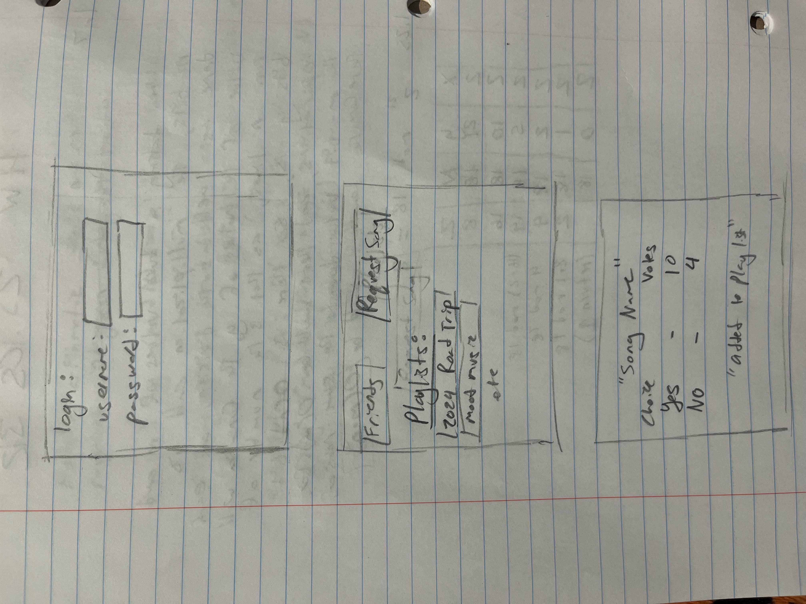
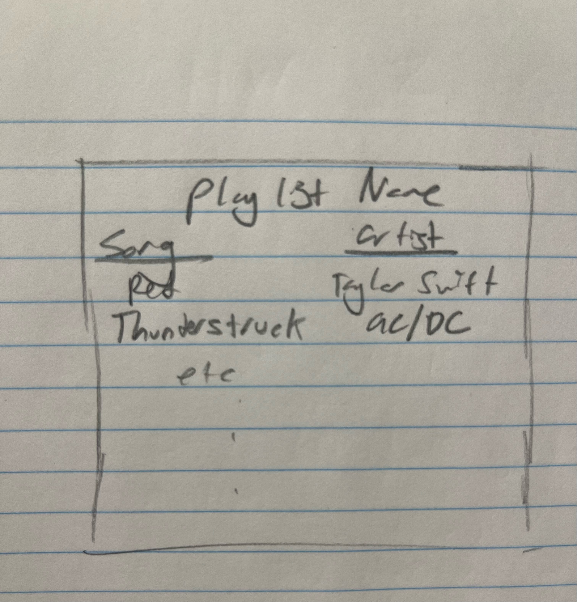

# Description deliverable

## Elevator Pitch

Have you ever been about to go on a roadtrip with your friends, and you just finished making the perfect playlist for the trip when one of your friends adds the entire Hamilton soundtrack to it? Or a really niche mongolian throat singing song that doesn't fit the vibes at all? This application (name pending) allows for a group of people to vote on which songs are added to a playlist. One person will propose a song, and the group will vote on if it should be added or not. If it gets 50% or more of the votes, it'll be added to a playlist, preventing just one person from ruining the playlist with their weird taste.

## Design

## Key features

- Secure login over HTTPS
- Ability to make friends and communicate with them 
- Can make and store playlists (lists of songs)
- Ability for friends to propose an addition to a playlist
- Ability for people to vote on an addition for a song
- People can see proposed songs, voting results, and changes to playlists in real time

## Technologies

I am going to use the required technologies in the following ways.

- **HTML** - Uses correct HTML structure for application. Three HTML pages. One for login, one for voting, one for looking at and generating playlist. Hyperlinks to choice artifact.
- **CSS** - Application styling that looks good on different screen sizes, uses good whitespace, color choice and contrast. - **Mostly done, will update later to add stuff that needs javascript to work**
- **JavaScript** - Provides login, allows users to propose new songs, applying votes, display other users votes, see users playlists, backend endpoint calls.
- **Service** - Backend service with endpoints for:
  - login
  - submitting votes
  - retrieving vote status
  - friend requests
- **DB/Login** - Store users, votes, and playlists in database. Register and login users. Credentials securely stored in database. Can't vote unless authenticated and a friend of the user.
- **WebSocket** - See the results of votes in real time and being able to see the playlist change in real time, also obtains info for all songs available on Spotify
- **React** - Application ported to use the React web framework.
